# Neo4j 知识图谱自然语言查询系统

基于 Neo4j 和 LLM（通义千问）的知识图谱自然语言查询与可视化系统，集成了完整的知识库管理功能。

## 一、功能特性

### 1. 自然语言查询模块

- ✅ **自然语言查询**：用中文问问题，自动生成 GraphQL 查询
- ✅ **智能回答**：LLM 生成清晰的中文答案，附带证据引用
- ✅ **图可视化**：使用 Cytoscape.js 展示知识图谱子图
- ✅ **证据高亮**：点击证据项，自动在图中高亮对应节点和边
- ✅ **两种模式**：问答模式（QA）和浏览模式（Browse）
- ✅ **安全保障**：查询变量化、结果限制、禁止危险操作

### 2. 知识库管理模块

- ✅ **节点管理**：查看、创建、编辑、删除节点，支持搜索和分页
- ✅ **关系管理**：查看、创建、编辑、删除关系，支持搜索和分页
- ✅ **智能展示**：折叠显示、节点信息可视化、关系方向清晰
- ✅ **标签过滤**：按节点标签和关系类型快速筛选
- ✅ **批量操作**：支持强制删除（同时删除关联关系）
- ✅ **模态编辑**：对话框形式编辑，无需滚动页面

## 二、系统截图

### 1. 自然语言查询界面

#### 1-1 提问栏输入

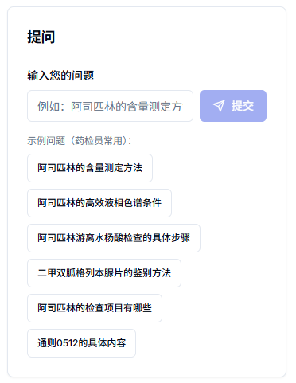

*图1-1 提问栏输入问题，系统提供示例问题参考*

### 2. 智能回答与证据引用

#### 2-1 LLM智能回答

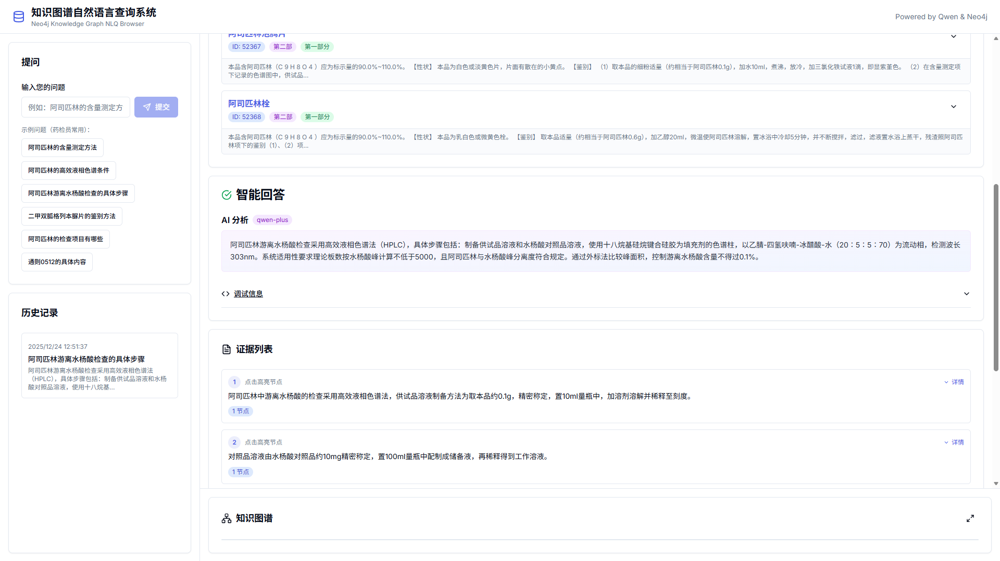

*图2-1 LLM 基于知识图谱数据生成智能回答*

#### 2-2 证据引用列表

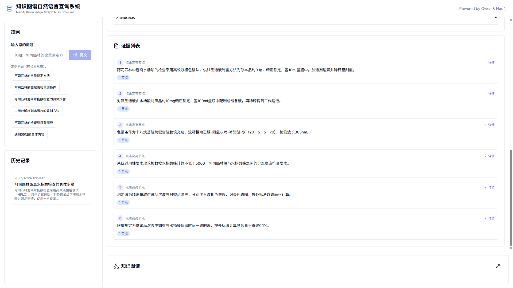

*图2-2 回答附带详细的证据引用列表，可追溯来源*

### 3. 知识图谱可视化

#### 3-1 数据库检索结果

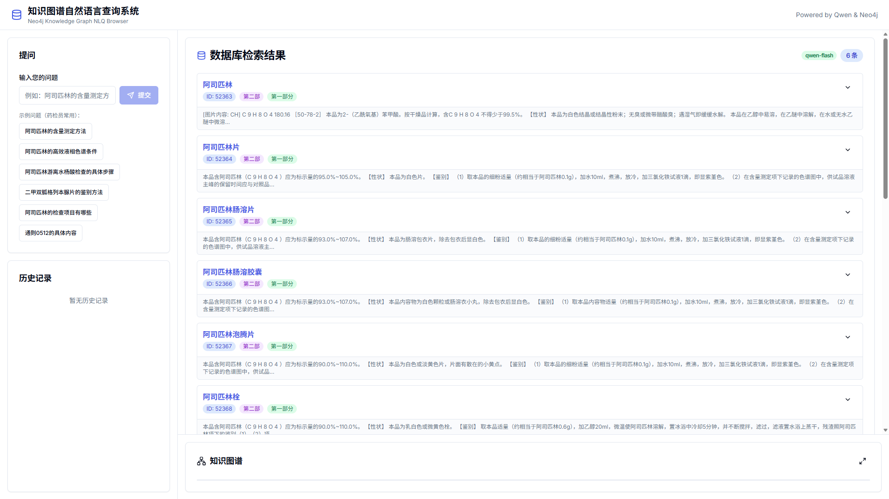

*图3-1 数据库检索结果展示，支持展开查看详情*

#### 3-2 前端可视化展示

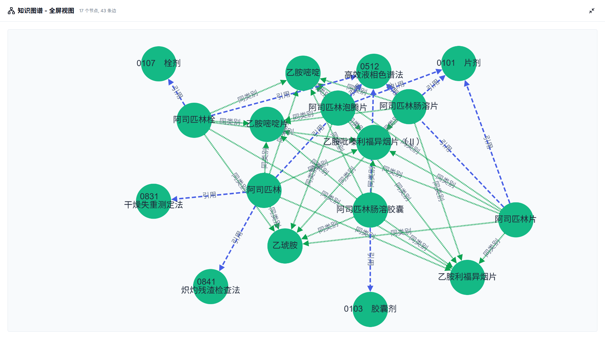

*图3-2 使用 Cytoscape.js 进行知识图谱的可视化展示*

### 4. 交互功能

#### 4-1 展开检索结果

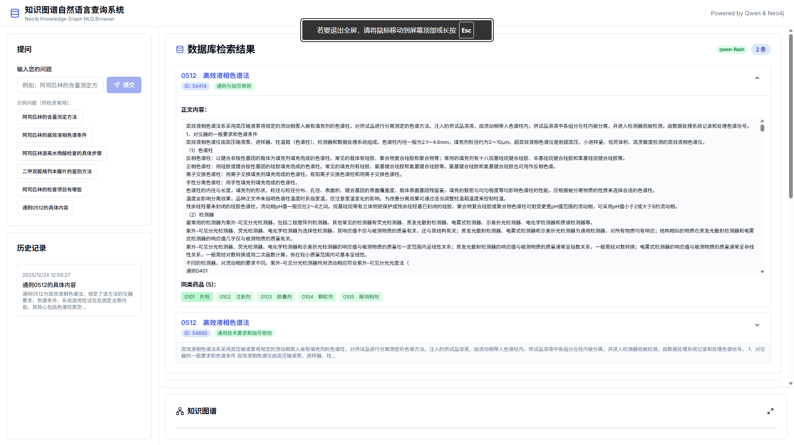

*图4-1 点击展开检索结果可以查看同类节点*

#### 4-2 节点详情查看（检索结果）


*图4-2 在检索结果中查看节点详细信息*

#### 4-3 节点详情查看（图谱可视化）

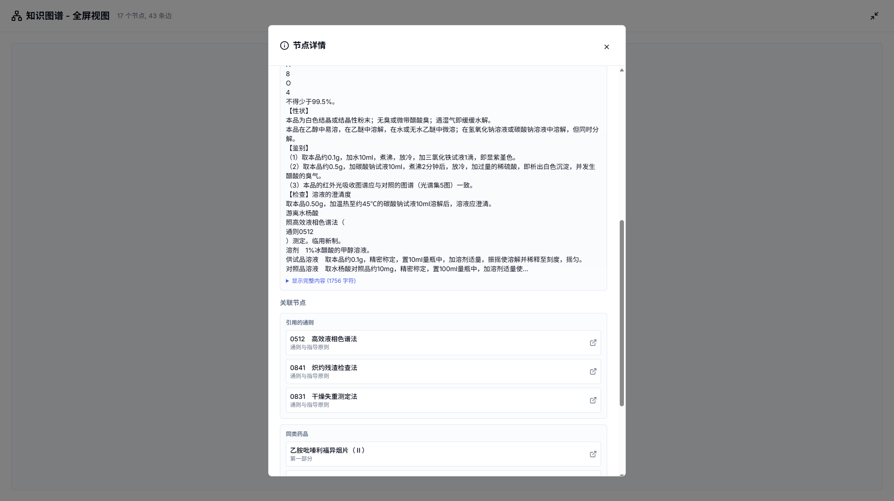

*图4-3 在图谱可视化中单击节点查看详细信息和关联关系*

### 5. 调试信息

#### 5-1 LLM输入输出

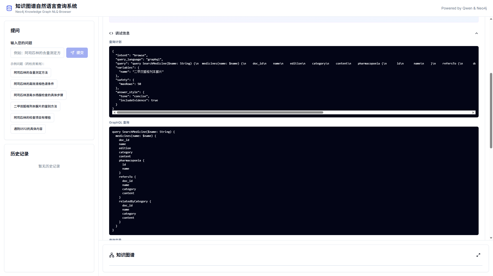

*图5-1 可查看 LLM 输入输出和 GraphQL 查询的调试信息*

### 6. 知识库管理界面

#### 6-1 节点管理


*图6-1 节点管理：查看、创建、编辑、删除节点，支持搜索、过滤和分页*

#### 6-2 关系管理

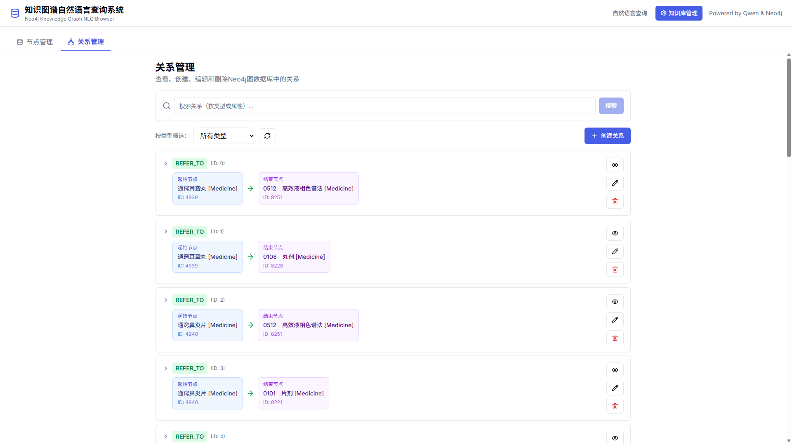

*图6-2 关系管理：查看、创建、编辑、删除关系，显示节点信息和方向*

## 三、数据源示例

### 1. Neo4j 知识图谱

#### 1-1 药典大纲结构

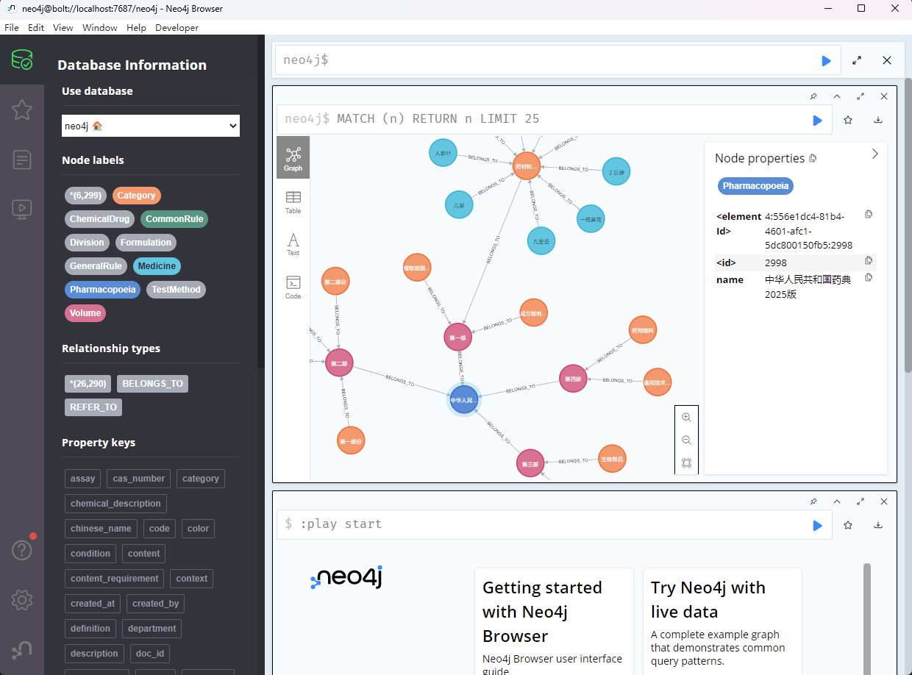

*图7 Neo4j 数据库展示了中国药典的大纲结构和各类节点*

#### 1-2 药品通则关联

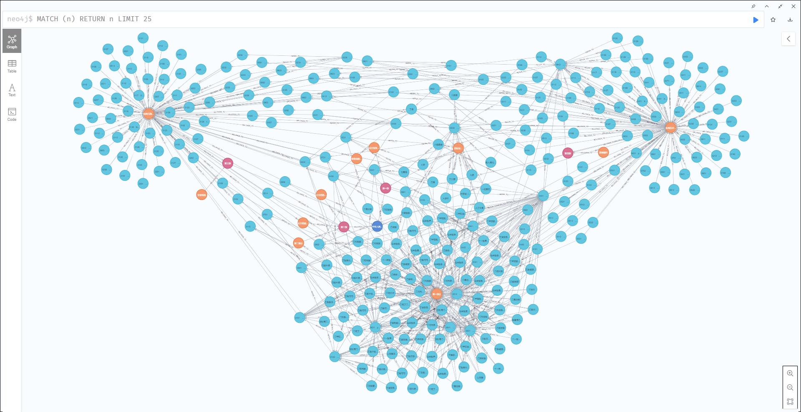

*图8 药品通则之间复杂的关联引用关系*

### 2. PostgreSQL 关系数据库

#### 2-1 药典数据存储

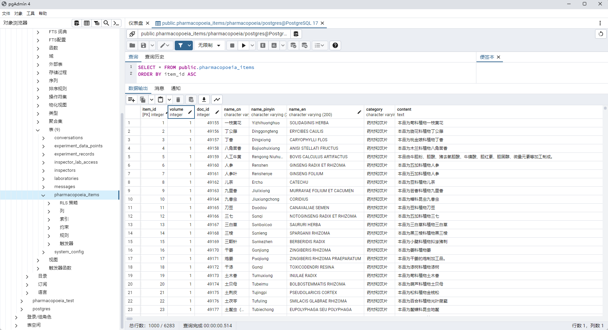

*图9 2025 版中国药典全 4 部数据存储在 PostgreSQL 中*

## 四、技术栈

- **前端**: Next.js 14 (App Router) + TypeScript + Tailwind CSS + shadcn/ui
- **图可视化**: Cytoscape.js
- **后端**: Apollo Server + @neo4j/graphql + RESTful API
- **数据库**: Neo4j
- **LLM**: 通义千问（兼容 OpenAI API）

## 五、快速开始

### 1. 环境要求

- Node.js 18+
- Neo4j 5.x（本地或远程实例）
- pnpm 或 npm

### 2. 安装依赖

```bash
# 使用 pnpm（推荐）
pnpm install

# 或使用 npm
npm install
```

### 3. 配置环境变量

复制 `.env.example` 为 `.env` 并填写配置：

```bash
cp .env.example .env
```

编辑 `.env` 文件：

```env
# Neo4j 配置
NEO4J_URI=bolt://localhost:7687
NEO4J_USER=neo4j
NEO4J_PASSWORD=your_password_here

# 通义千问配置
LLM_BASE_URL=https://dashscope.aliyuncs.com/compatible-mode/v1
LLM_API_KEY=sk-your-qwen-api-key
LLM_MODEL=qwen-turbo

# 限制配置（可选）
NLQ_MAX_ROWS=50
NLQ_MAX_NODES=80
NLQ_MAX_EDGES=120
```

#### 3-1 获取通义千问 API Key

1. 访问：https://help.aliyun.com/zh/model-studio/get-api-key
2. 注册阿里云账号
3. 开通通义千问服务
4. 获取 API Key

**推荐模型**：

- `qwen-turbo`：快速响应，适合实时查询
- `qwen-plus`：平衡性能，适合日常使用
- `qwen-max`：最强性能，适合复杂查询

### 4. 准备 Neo4j 数据

#### 4-1 方式一：使用示例数据

项目内置了一个示例 schema（Person、Drug、Disease）。你需要在 Neo4j 中创建相应的数据：

```cypher
// 创建示例数据
CREATE (p1:Person {id: "p1", name: "张三", affiliation: "清华大学"})
CREATE (p2:Person {id: "p2", name: "李四", affiliation: "北京大学"})

CREATE (d1:Drug {id: "d1", name: "阿司匹林", description: "非甾体抗炎药"})
CREATE (d2:Drug {id: "d2", name: "布洛芬", description: "解热镇痛药"})

CREATE (dis1:Disease {id: "dis1", name: "心脏病", description: "心血管疾病"})
CREATE (dis2:Disease {id: "dis2", name: "头痛", description: "常见症状"})

CREATE (p1)-[:RESEARCHES]->(d1)
CREATE (p2)-[:RESEARCHES]->(d2)
CREATE (d1)-[:TREATS]->(dis1)
CREATE (d2)-[:TREATS]->(dis2)
```

#### 4-2 方式二：修改 Schema 适配你的图谱

编辑 `server/graphql/schema.ts`，修改 `typeDefs` 以匹配你的 Neo4j 图谱结构。

### 5. 启动开发服务器

```bash
# 使用 pnpm
pnpm dev

# 或使用 npm
npm run dev
```

访问：http://localhost:3000

### 6. 使用系统

#### 6-1 自然语言查询

**访问地址**: http://localhost:3000

##### 6-1-1 问答模式（QA）

输入问题：

- "阿司匹林治疗什么疾病？"
- "有哪些研究人员在研究心脏病药物？"
- "布洛芬是什么？"

##### 6-1-2 浏览模式（Browse）

输入问题：

- "展示阿司匹林的关系网络"
- "浏览心脏病相关的子图"

#### 6-2 知识库管理

**访问地址**: http://localhost:3000/admin

或点击顶部导航栏的"知识库管理"按钮。

##### 6-2-1 节点管理

1. **查看节点**：

   - 默认显示所有节点（每页20条）
   - 按标签筛选节点
   - 搜索节点（按名称、ID或其他属性）
   - 点击节点展开查看完整属性

2. **创建节点**：

   - 点击"创建节点"按钮
   - 输入标签（逗号分隔）：`Medicine,Drug`
   - 输入属性（JSON格式）：

   ```json
   {
     "name": "阿司匹林",
     "description": "非甾体抗炎药"
   }
   ```

3. **编辑节点**：

   - 点击节点的编辑按钮（铅笔图标）
   - 在弹出的对话框中修改属性
   - 保存更改

4. **删除节点**：

   - 点击删除按钮（垃圾桶图标）
   - 确认删除（自动处理关联关系）

##### 6-2-2 关系管理

1. **查看关系**：

   - 显示起始节点、关系类型、结束节点
   - 按关系类型筛选
   - 搜索关系
   - 点击展开查看完整属性

2. **创建关系**：

   - 点击"创建关系"按钮
   - 输入起始节点ID、结束节点ID
   - 输入关系类型：`TREATS`, `RESEARCHES`
   - 输入属性（可选）

3. **编辑关系**：

   - 点击编辑按钮
   - 修改关系属性（类型和方向不可修改）

4. **删除关系**：

   - 点击删除按钮并确认

**提示**：在节点管理页面可以查看节点ID，用于创建关系。

## 六、项目结构

```
kg-nlq/
├── app/                      # Next.js App Router
│   ├── api/
│   │   ├── nlq/route.ts     # NLQ API 端点
│   │   ├── graphql/route.ts # GraphQL API 端点
│   │   └── admin/           # 管理 API
│   │       ├── nodes/       # 节点增删改查
│   │       ├── relationships/ # 关系增删改查
│   │       ├── labels/      # 标签查询
│   │       └── relationship-types/ # 关系类型查询
│   ├── admin/               # 管理页面
│   │   └── page.tsx         # 知识库管理主页
│   ├── page.tsx             # 自然语言查询主页
│   ├── layout.tsx           # 根布局
│   └── globals.css          # 全局样式
├── components/              # React 组件
│   ├── ui/                  # shadcn/ui 基础组件
│   ├── admin/               # 管理功能组件
│   │   ├── NodeManager.tsx      # 节点管理
│   │   └── RelationshipManager.tsx # 关系管理
│   ├── ChatPanel.tsx        # 聊天面板
│   ├── AnswerPanel.tsx      # 答案展示
│   ├── EvidenceList.tsx     # 证据列表
│   ├── GraphCanvas.tsx      # 图可视化
│   └── Topbar.tsx           # 顶部导航
├── lib/                     # 工具库
│   ├── types.ts             # TypeScript 类型定义
│   ├── config.ts            # 配置管理
│   ├── utils.ts             # 工具函数
│   └── apolloClient.ts      # Apollo Client 配置
├── server/                  # 服务端逻辑
│   ├── graphql/             # GraphQL 服务
│   │   ├── schema.ts        # Neo4j GraphQL Schema
│   │   ├── server.ts        # Apollo Server
│   │   └── context.ts       # Neo4j Driver 管理
│   ├── nlq/                 # NLQ 编排层
│   │   ├── orchestrator.ts  # 主编排逻辑
│   │   ├── prompts.ts       # LLM 提示词
│   │   ├── validators.ts    # 验证器
│   │   ├── schemaDigest.ts  # Schema 摘要
│   │   └── postprocess.ts   # 结果后处理
│   └── llm/                 # LLM 客户端
│       └── client.ts        # 通义千问客户端
├── doc/                     # 文档
│   ├── ADMIN_GUIDE.md       # 管理功能使用指南
│   └── IMPLEMENTATION_SUMMARY.md # 实施总结
├── figs/                    # 截图
├── .env.example             # 环境变量示例
├── package.json             # 项目依赖
├── tsconfig.json            # TypeScript 配置
├── tailwind.config.ts       # Tailwind 配置
└── README.md                # 本文件
```

## 七、核心流程

### 1. NLQ 处理流程（两段式）

```
用户问题
    ↓
[阶段 1] LLM 生成查询计划 (QueryPlan)
    ├─ 分析意图 (qa/browse)
    ├─ 生成 GraphQL 查询
    ├─ 变量化用户输入
    └─ 设置安全限制
    ↓
[验证] 查询计划校验
    ├─ 检查语法
    ├─ 检查安全性
    └─ 必要时自动修复
    ↓
[执行] Neo4j GraphQL 查询
    ↓
[后处理] 提取节点/边，生成证据
    ↓
[阶段 2] LLM 生成自然语言答案
    ├─ 基于查询结果
    ├─ 生成中文回答
    └─ 关联证据项
    ↓
返回完整响应
```

## 八、修改 Schema

如果你有自己的 Neo4j 图谱，需要修改 `server/graphql/schema.ts`：

```typescript
export const typeDefs = `
  type YourNodeType {
    id: ID! @id
    name: String!
    // 添加你的属性
  }
  
  type AnotherNodeType {
    id: ID! @id
    name: String!
    // 添加你的属性
    relatedNodes: [YourNodeType!]! @relationship(type: "YOUR_RELATIONSHIP", direction: OUT)
  }
`;
```

同时更新 `getSchemaDigest()` 函数，为 LLM 提供准确的 schema 描述。

## 九、知识库管理功能

### 1. 功能特性

#### 1-1 节点管理

- **查看**: 列表展示、折叠/展开详情、分页显示（每页20条）
- **搜索**: 按名称、ID或任意属性搜索
- **过滤**: 按节点标签筛选
- **创建**: 对话框表单，支持多标签和JSON属性
- **编辑**: 模态编辑，无需滚动到页面顶部
- **删除**: 强制删除，自动处理关联关系

#### 1-2 关系管理

- **查看**: 显示节点信息、关系类型、方向，支持分页
- **搜索**: 按关系类型或属性搜索
- **过滤**: 按关系类型筛选
- **创建**: 输入节点ID和关系类型
- **编辑**: 修改关系属性（类型和方向不可修改）
- **删除**: 删除关系，不影响节点

#### 1-3 智能展示

- **折叠显示**: 默认折叠，点击展开查看完整内容
- **智能命名**: 自动提取节点名称显示
- **Neo4j类型转换**: 自动将Neo4j Integer转为普通数字
- **视觉区分**: 颜色编码（起始节点蓝色、结束节点紫色、关系绿色）
- **方向指示**: 清晰的箭头显示关系方向

### 2. API 接口

#### 2-1 节点管理 API

```
GET    /api/admin/nodes              # 查询节点（支持 label, limit, skip）
POST   /api/admin/nodes              # 创建节点
PUT    /api/admin/nodes              # 更新节点
DELETE /api/admin/nodes              # 删除节点（支持 detachDelete）
POST   /api/admin/nodes/search       # 搜索节点
GET    /api/admin/nodes/info         # 获取节点信息
GET    /api/admin/labels             # 获取所有标签
```

#### 2-2 关系管理 API

```
GET    /api/admin/relationships      # 查询关系（支持 type, limit, skip）
POST   /api/admin/relationships      # 创建关系
PUT    /api/admin/relationships      # 更新关系
DELETE /api/admin/relationships      # 删除关系
POST   /api/admin/relationships/search # 搜索关系
GET    /api/admin/relationship-types # 获取所有关系类型
```

### 3. 使用技巧

#### 3-1 JSON 属性格式

属性必须使用有效的 JSON 格式：

**正确示例**：

```json
{
  "name": "张三",
  "age": 30,
  "active": true,
  "tags": ["研究员", "教授"]
}
```

**常见错误**：

- ❌ 属性名没有双引号：`{name: "张三"}`
- ❌ 字符串使用单引号：`{"name": '张三'}`
- ❌ 末尾有多余逗号：`{"name": "张三",}`

#### 3-2 命名规范

**节点标签**：

- 使用大写字母开头的驼峰命名：`Person`, `DrugCompound`
- 多个标签用逗号分隔：`Person,Researcher`
- 避免使用特殊字符和空格

**关系类型**：

- 使用全大写，单词间用下划线：`RESEARCHES`, `WORKS_WITH`
- 使用动词表示动作：`KNOWS`, `TREATS`, `DEVELOPS`

### 4. 详细文档

- **使用指南**: [doc/ADMIN_GUIDE.md](doc/ADMIN_GUIDE.md)
- **实施总结**: [doc/IMPLEMENTATION_SUMMARY.md](doc/IMPLEMENTATION_SUMMARY.md)

## 十、常见问题

### 1. LLM 生成的查询失败？

**原因**：LLM 可能不熟悉你的 schema。

**解决**：

- 确保 `schemaDigest.ts` 中的 schema 描述清晰
- 在提示词中添加更多查询示例
- 尝试使用 `qwen-plus` 或 `qwen-max` 模型

### 2. 如何调整结果数量限制？

修改 `.env` 文件：

```env
NLQ_MAX_ROWS=100     # 最多返回的行数
NLQ_MAX_NODES=150    # 最多显示的节点数
NLQ_MAX_EDGES=200    # 最多显示的边数
```

### 3. Neo4j 连接失败？

检查：

- Neo4j 服务是否启动
- URI、用户名、密码是否正确
- 防火墙是否开放 7687 端口

### 4. GraphQL 查询权限问题？

建议为 Neo4j 用户设置只读权限：

```cypher
// 创建只读角色
CREATE ROLE nlq_readonly;
GRANT MATCH {*} ON GRAPH * TO nlq_readonly;
DENY WRITE ON GRAPH * TO nlq_readonly;

// 分配给用户
GRANT ROLE nlq_readonly TO your_user;
```

### 5. 通义千问 API 调用超时？

修改 `server/llm/client.ts` 中的 `timeout` 参数：

```typescript
this.timeout = options?.timeout ?? 120000; // 增加到 120 秒
```

### 6. 管理功能创建节点/关系失败？

**检查**：

- JSON 格式是否正确（使用双引号，无多余逗号）
- 关系创建时，起始和结束节点ID是否存在
- 查看浏览器控制台的详细错误信息

### 7. 节点属性显示为 `{low: X, high: 0}`？

这是 Neo4j Integer 类型的表示，系统已自动转换。如果仍然出现，请刷新页面。

## 十一、安全注意事项

### 1. 自然语言查询模块

✅ **已实现的安全措施**：

- 用户输入不直接拼接到查询（使用变量）
- 禁止 mutation 操作
- 强制结果数量限制
- 查询计划验证
- 危险模式检测

### 2. 知识库管理模块

✅ **已实现的安全措施**：

- 参数化查询（防止 Cypher 注入）
- 错误信息不暴露敏感信息
- 删除操作需要确认
- Neo4j Integer 类型自动转换

⚠️ **建议的额外措施**：

- 使用只读 Neo4j 用户（针对自然语言查询）
- 实现速率限制（API 层）
- 添加用户认证和权限管理
- 监控 LLM API 使用量
- 生产环境中限制管理功能访问

## 十二、性能优化

### 1. 自然语言查询

- **Schema Digest 缓存**：启动时生成一次，避免重复计算
- **Neo4j Driver 复用**：单例模式，避免频繁连接
- **结果裁剪**：后端限制返回数据量
- **前端分页**：历史记录仅保留最近 20 条

### 2. 知识库管理

- **分页查询**：每页显示 20 条记录，按需加载
- **懒加载节点信息**：关系管理中按需获取节点详情
- **折叠显示**：默认折叠减少渲染压力
- **搜索优化**：使用 Neo4j 索引提升搜索速度

## 十三、生产部署

### 1. 环境变量配置

确保生产环境设置了所有必需的环境变量。

### 2. 构建生产版本

```bash
pnpm build
pnpm start
```

### 3. Docker 部署（可选）

创建 `Dockerfile`：

```dockerfile
FROM node:18-alpine
WORKDIR /app
COPY package*.json ./
RUN npm install --production
COPY . .
RUN npm run build
EXPOSE 3000
CMD ["npm", "start"]
```

## 十四、许可

GNU AGPL v3

## 十五、更新日志

### 1. v2.2.0 (最新)

- ✅ 新增知识库管理功能
  - 节点增删改查
  - 关系增删改查
  - 搜索和过滤功能
  - 分页显示
  - 模态对话框编辑
  - 折叠显示优化
- ✅ Neo4j Integer 类型自动转换
- ✅ 完整的 RESTful API
- ✅ 详细的文档和使用指南

### 2. v1.0.0

- ✅ 自然语言查询功能
- ✅ LLM 智能回答
- ✅ 图谱可视化
- ✅ 证据引用

---

**Powered by**:

- [Next.js](https://nextjs.org/)
- [Neo4j](https://neo4j.com/)
- [通义千问](https://help.aliyun.com/zh/model-studio/)
- [Cytoscape.js](https://js.cytoscape.org/)
